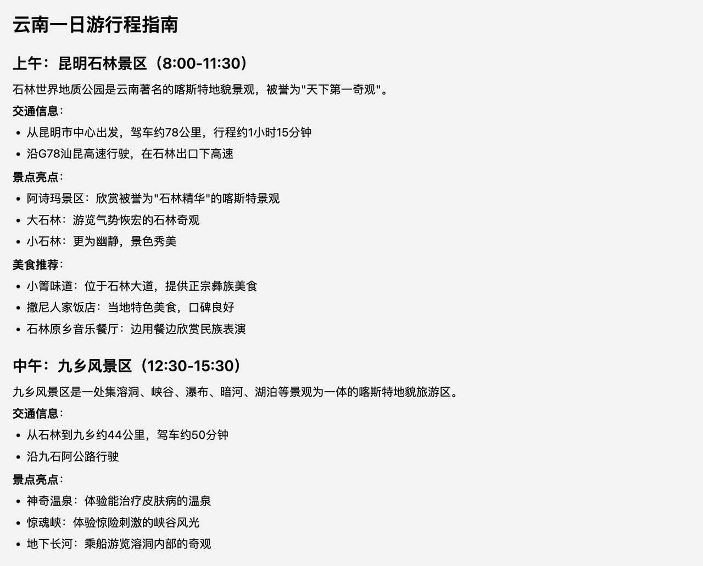
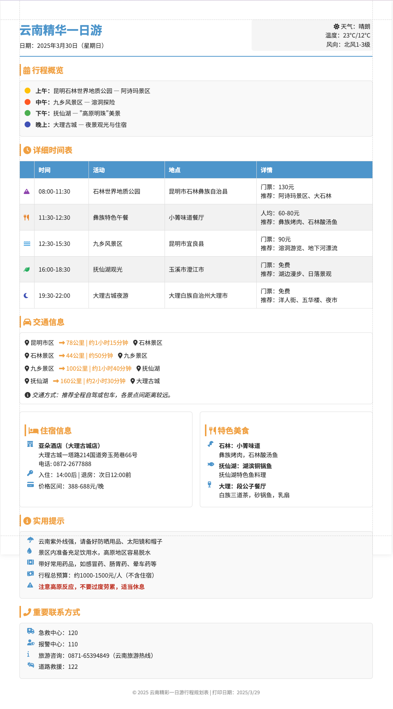

# How to run it?
1. Clone the repository
2. Install dependencies
   ```bash
   pnpm install
   ```
   ```bash
   pnpm setup
   pnpm install -g @cablate/mcp-google-map
   ```
3. Run the development server
   ```bash
    pnpm dev
    ```
4. Open your browser and go to `http://localhost:3000`


# 技术路线

因为我的口腔溃疡, 我无法说话. 现在做一下会议将要讲的事情.
### 1. 已做的部分:

1. 首页-
   - 设计了一个简单的首页, 有AI的对话框, 此处有[TODO0](#TODO0)
   - 原理是用户传入的第一句对话, 会同时触发两件事情
     1. 发送给后端, 调用[Gemini API](https://www.gemini.com/)进行处理
           ----> Gemini会返回一个初步的JSON格式,跳转到[TODO1](#TODO1)
           ----> 用户确定后美化界面[TODO2](#todo2), 参考[MCP指南](https://o90p05z3t4.feishu.cn/wiki/Vldsw7DYdiJHe4kmzcJc0wzTnIc)
     2. 跳转到次界面,
           ----> [TODO3](#TODO3)
2. 这个时候大家也发现了, 如果一个用户始终疯狂调用API, 我们会死得很快
   - 所以我们需要一个[用户系统, 即TODO后端1](#TODO后端1)
   - 我们有了用户,是否可以让用户保存历史记录呢? [TODO后端2](#TODO后端2)

### TODO0:
1. 判断用户输入的值是否为空, 不允许为空
2. 告诉gemini如果用户没有提供时间, 则默认从今天开始

### TODO1:
解析JSON格式:
1. 获取地名, 调用MCP获取地名对应的坐标
2. 调用GMAP API, 在地图上面显示
3. Bonus: 用这些地名以及先后顺序做出导航

### TODO2:
1. 渲染出旅行计划的初始样式
2. 于TODO1的地图合并(仅限前端样式)

### TODO3:
1. 用户只能对左侧的旅行计划提出修改意见
2. 渲染最终效果, 此处应该调用图片API.

### TODO后端1:
1. 设计一个简单的用户登录注册系统
2. 设计一个简单的用户信息存储系统
3. 设计一个简单的用户信息查询系统
4. 设计一个简单的用户信息修改系统
5. 设计一个简单的用户信息删除系统
4.5 部分为Bonus 展示不用完成, 这部分用`ORM`解析

### TODO后端2:
1. 设计一个简单的用户历史记录存储系统
2. 调用`api.chats.create`

